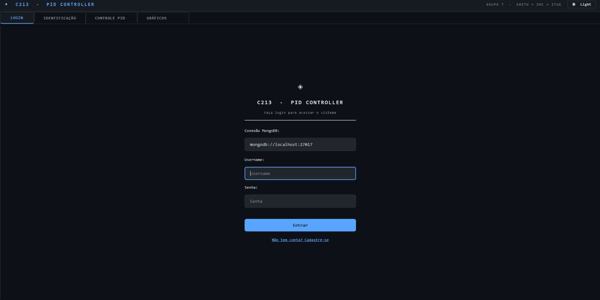
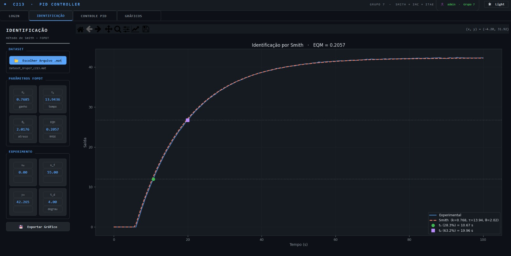
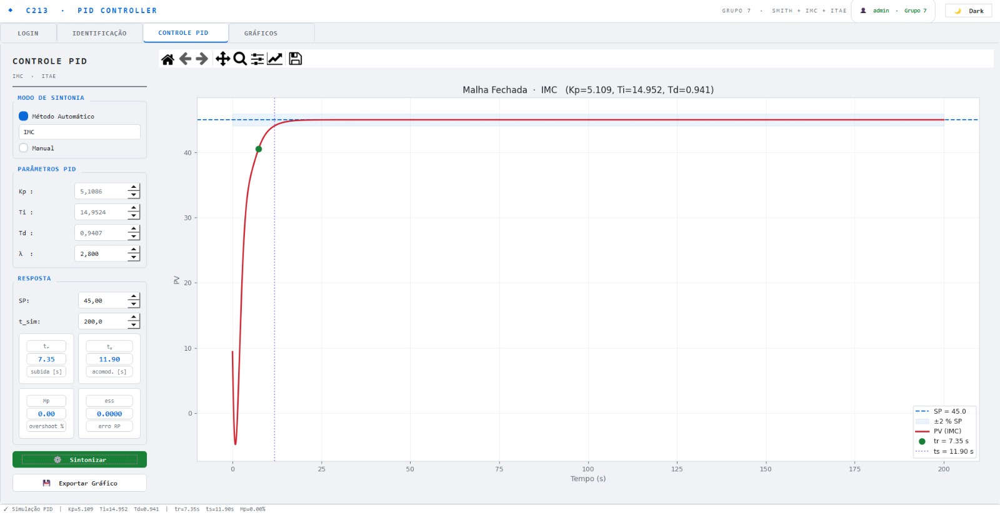
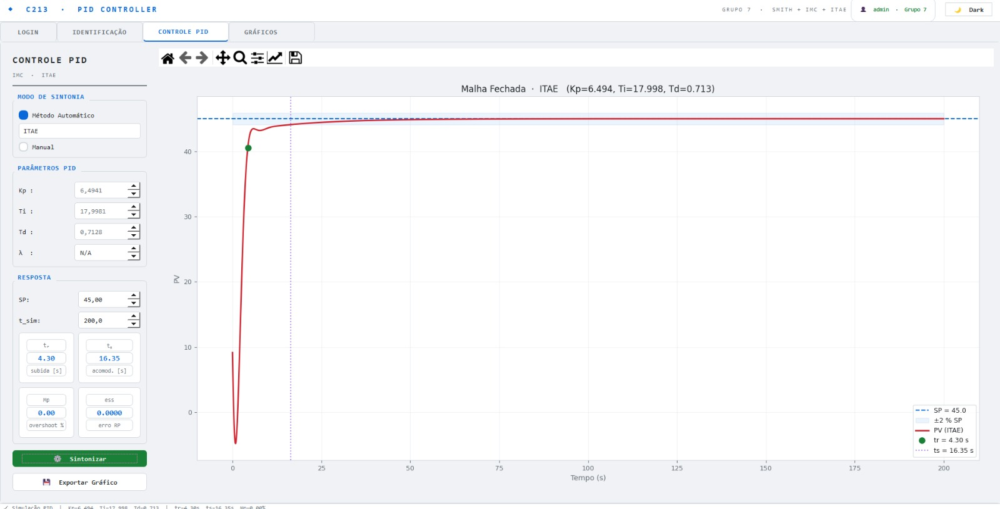
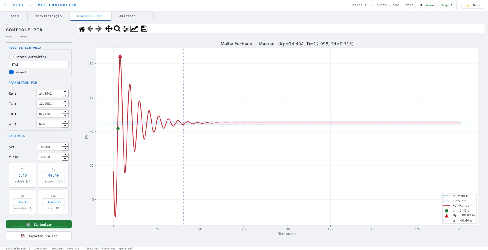
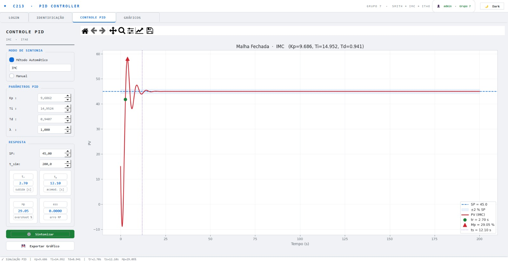
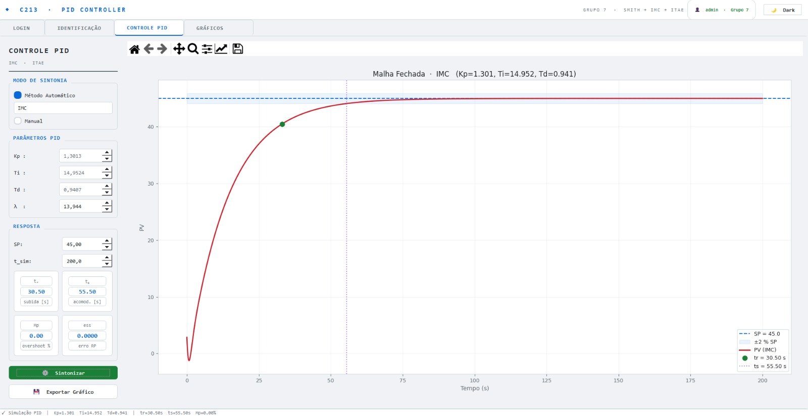
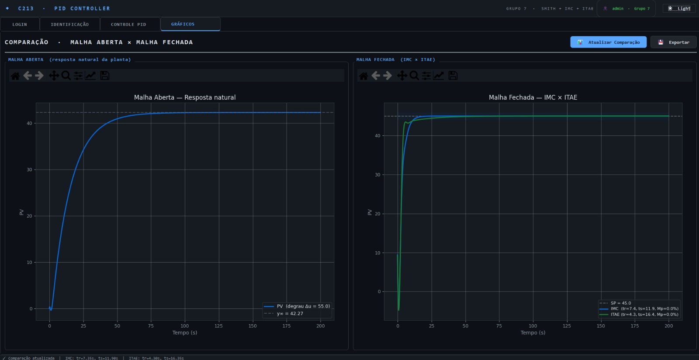

# C213 - PID Controller

Projeto desenvolvido para a disciplina **C213 - Sistemas Embarcados**. A aplicação realiza identificação de uma planta em malha aberta, sintonia de controladores PID e comparação entre respostas em malha aberta e malha fechada por meio de uma IHM em Python com autenticação de usuários via MongoDB.

**Grupo:** 7  
**Métodos de sintonia do grupo:** IMC e ITAE  
**Arquitetura:** MVC, com separação entre interface, controlador, módulos matemáticos e autenticação

## Integrantes

| Nome | Matrícula |
|---|---:|
| DAVÍ PADULA RABELO | 1917 |
| KAUÃ VICTOR GARCIA SIÉCOLA | 1887 |
| MATHEUS RENÓ TORRES | 1954 |

## Objetivo

O objetivo do projeto é integrar identificação de sistemas, controle PID e autenticação de usuários em uma aplicação computacional capaz de:

1. autenticar usuários por login e cadastro com persistência em MongoDB;
2. carregar datasets experimentais em formato `.mat`;
3. identificar automaticamente uma planta por um modelo FOPDT usando o método de Smith;
4. sintonizar controladores PID pelos métodos IMC e ITAE, definidos para o Grupo 7;
5. simular a resposta em malha fechada para um setpoint configurável;
6. calcular métricas de desempenho, como tempo de subida, tempo de acomodação, sobressinal e erro em regime permanente;
7. comparar a resposta natural da planta com as respostas controladas por IMC e ITAE;
8. exportar os gráficos gerados pela IHM.

## Funcionalidades

| Área | Funcionalidade |
|---|---|
| Autenticação | Login, cadastro e logout com usuários armazenados no MongoDB |
| Banco de dados | Conexão configurável por URI e uso da coleção `usuarios` |
| Dataset | Leitura de arquivos MATLAB `.mat` contendo tempo, entrada e saída |
| Identificação | Identificação automática FOPDT pelo método de Smith logo após carregar o arquivo |
| Experimento | Exibição de `u0`, `uf`, `y∞` e `t_d` na aba de identificação |
| Sintonia PID | Cálculo automático por IMC ou ITAE e modo manual para `Kp`, `Ti` e `Td` |
| Lambda | Campo `λ` habilitado para IMC e exibido como `N/A` para ITAE |
| Simulação | Uso de funções de transferência e `scipy.signal.lsim` |
| Atraso | Aproximação de Padé para o atraso de transporte nas simulações em função de transferência |
| Estabilidade | Verificação dos polos da malha fechada antes da simulação |
| Métricas | Cálculo de `tr`, `ts`, `Mp`, `ess`, valor final, pico e tempo de pico |
| Visualização | Gráficos interativos com Matplotlib integrado ao PyQt5 |
| Comparação | Gráficos lado a lado: malha aberta e IMC × ITAE |
| Exportação | Salvamento de gráficos em PNG ou PDF |
| Interface | Aba de Login, abas bloqueadas antes da autenticação, tema escuro e tema claro |

## Estrutura do projeto

```text
C213/
├─ app/
│  ├─ controllers/
│  │  ├─ __init__.py
│  │  └─ main_controller.py
│  ├─ models/
│  │  ├─ __init__.py
│  │  ├─ auth.py
│  │  ├─ identification.py
│  │  └─ pid_tuning.py
│  └─ views/
│     ├─ __init__.py
│     └─ main_window.py
├─ docs/
│  ├─ GUIA_USO.md
│  ├─ MATEMATICA_CONTROLE.md
│  ├─ MODULOS.md
│  └─ assets/
│     ├─ figura_01_login.png
│     ├─ figura_02_identificacao_smith.png
│     ├─ figura_03_controle_pid_imc.png
│     ├─ figura_04_controle_pid_itae.png
│     ├─ figura_05_controle_pid_manual.png
│     ├─ figura_06_imc_lambda_menor.png
│     ├─ figura_07_imc_lambda_maior.png
│     └─ figura_08_comparacao_imc_itae.png
├─ main.py
├─ requirements.txt
├─ README.md
└─ .gitignore
```

| Camada | Arquivos | Responsabilidade |
|---|---|---|
| View | `app/views/main_window.py` | IHM, Login, abas, campos, botões, cartões, temas e gráficos |
| Controller | `app/controllers/main_controller.py` | Autenticação, carregamento de dados, conexão entre eventos da IHM e funções matemáticas, atualização dos gráficos |
| Model | `app/models/auth.py`, `app/models/identification.py` e `app/models/pid_tuning.py` | Autenticação com MongoDB, identificação FOPDT, sintonia PID, funções de transferência, simulação e métricas |
| Entrada | `main.py` | Inicialização do `QApplication`, criação da janela principal e criação do Controller |

## Instalação e execução

### 1. Criar ambiente virtual

Linux ou macOS:

```bash
python3 -m venv .venv
source .venv/bin/activate
```

Windows PowerShell:

```powershell
python -m venv .venv
.\.venv\Scripts\activate
```

### 2. Instalar dependências

```bash
python3 -m pip install --upgrade pip
python3 -m pip install -r requirements.txt
```

Dependências principais:

```text
PyQt5>=5.15.0
numpy>=1.21.0
scipy>=1.7.0
matplotlib>=3.4.0
pymongo>=3.12.0
```

### 3. Banco de dados

A autenticação usa MongoDB. Por padrão, a IHM tenta conectar em:

```text
mongodb://localhost:27017
```

O banco utilizado é `C213` e a coleção de usuários é `usuarios`. A URI pode ser alterada na aba **Login**.

### 4. Executar a aplicação

```bash
python3 main.py
```

Em algumas instalações Linux com Wayland, o Qt pode exigir bibliotecas adicionais para o backend XCB:

```bash
sudo apt install libxcb-cursor0 libxcb-xinerama0 libxkbcommon-x11-0
QT_QPA_PLATFORM=xcb python3 main.py
```

## Formato esperado do dataset

O arquivo `.mat` deve conter três vetores principais:

| Grandeza | Nomes aceitos pelo código |
|---|---|
| Tempo | `tiempo`, `tempo`, `t`, `time` |
| Entrada | `entrada`, `u`, `input` |
| Saída | `salida`, `saida`, `y`, `output` |

Após o carregamento, o programa executa a identificação automaticamente. Não há botão separado de identificação na versão atual.

## Fluxo de uso

1. Abrir a aba **Login**.
2. Informar a URI do MongoDB, usuário e senha.
3. Cadastrar um usuário, caso ainda não exista conta.
4. Fazer login para liberar as abas de Identificação, Controle PID e Gráficos.
5. Abrir a aba **Identificação**.
6. Clicar em **Escolher Arquivo .mat**.
7. Selecionar o dataset experimental.
8. Aguardar a identificação automática pelo método de Smith.
9. Verificar os parâmetros FOPDT: `k`, `τ`, `θ` e `EQM`.
10. Verificar os dados do experimento: `u0`, `uf`, `y∞` e `t_d`.
11. Abrir a aba **Controle PID**.
12. Escolher **IMC**, **ITAE** ou modo **Manual**.
13. Ajustar `SP`, `t_sim` e, no caso do IMC, `λ`.
14. Clicar em **Sintonizar**.
15. Analisar a resposta em malha fechada e as métricas.
16. Abrir a aba **Gráficos** e clicar em **Atualizar Comparação**.
17. Exportar os gráficos, se necessário.

## Modelo matemático

A planta é aproximada por um modelo FOPDT:

$$
G(s)=\frac{k e^{-\theta s}}{\tau s+1}
$$

em que `k` é o ganho estático, `τ` é a constante de tempo e `θ` é o atraso de transporte.

## Identificação pelo método de Smith

O ganho estático é calculado por:

$$
k=\frac{\Delta y}{\Delta u}
$$

com:

$$
\Delta u=u_f-u_0
$$

$$
\Delta y=y_{\infty}-y_0
$$

Os pontos característicos são:

$$
y_{28,3}=y_0+0,283\Delta y
$$

$$
y_{63,2}=y_0+0,632\Delta y
$$

Após encontrar `t1` e `t2`, são calculados os tempos relativos ao instante do degrau:

$$
t_{1,rel}=t_1-t_d
$$

$$
t_{2,rel}=t_2-t_d
$$

Os parâmetros do modelo são:

$$
\tau=1,5(t_{2,rel}-t_{1,rel})
$$

$$
\theta=t_{2,rel}-\tau
$$

O indicador exibido como `EQM` é o erro quadrático médio:

$$
EQM=\frac{1}{N}\sum_{i=1}^{N}(\hat{y}_i-y_i)^2
$$

## Sintonia PID

A lei contínua de referência do controlador PID é:

$$
u(t)=K_p\left[e(t)+\frac{1}{T_i}\int_0^t e(\xi)d\xi+T_d\frac{de(t)}{dt}\right]
$$

com:

$$
e(t)=SP-y(t)
$$

### Método IMC

$$
K_p=\frac{2\tau+\theta}{k(2\lambda+\theta)}
$$

$$
T_i=\tau+\frac{\theta}{2}
$$

$$
T_d=\frac{\tau\theta}{2\tau+\theta}
$$

### Método ITAE

O critério ITAE é:

$$
ITAE=\int_0^{\infty}t|e(t)|dt
$$

A implementação usa:

$$
r=\frac{\theta}{\tau}
$$

$$
K_p=\frac{0,965}{k}r^{-0,85}
$$

$$
T_i=\frac{\tau}{0,796-0,147r}
$$

$$
T_d=0,308\tau r^{0,929}
$$

## Simulação e estabilidade

O atraso é aproximado por Padé antes da montagem das funções de transferência. A malha fechada é:

$$
T(s)=\frac{C(s)G(s)}{1+C(s)G(s)}
$$

A estabilidade é avaliada pelos polos da malha fechada:

$$
\operatorname{Re}(p_i)<0
$$

Se a malha fechada estiver instável no modo manual, a simulação é bloqueada. Em modo automático, a IHM emite aviso.

## Métricas de desempenho

| Métrica | Símbolo | Definição |
|---|---:|---|
| Tempo de subida | `tr` | diferença entre os instantes de 10% e 90% do valor final |
| Tempo de acomodação | `ts` | último instante fora da banda de ±2% do valor final |
| Sobressinal | `Mp` | pico acima do valor final, em percentual |
| Erro em regime permanente | `ess` | diferença entre setpoint e valor final |

## IHM e resultados

### Figura 1 - Login e conexão com MongoDB



A Figura 1 mostra a aba **Login**, usada para informar a URI do MongoDB, autenticar o usuário ou acessar a tela de cadastro.

### Figura 2 - Identificação por Smith



A Figura 2 mostra a aba **Identificação**, com carregamento do dataset, parâmetros FOPDT, dados do experimento e gráfico com os pontos de 28,3% e 63,2% usados pelo método de Smith.

### Figura 3 - Controle PID com IMC



A Figura 3 mostra a resposta em malha fechada usando sintonia IMC. O campo `λ` permanece habilitado por ser o parâmetro de projeto do método.

### Figura 4 - Controle PID com ITAE



A Figura 4 mostra a resposta em malha fechada usando sintonia ITAE. Nesse método, o campo `λ` aparece como `N/A`.

### Figura 5 - Controle PID manual



A Figura 5 mostra o modo manual, no qual os valores de `Kp`, `Ti` e `Td` podem ser inseridos diretamente para avaliar ajustes específicos.

### Figura 6 - IMC com λ menor



A Figura 6 ilustra uma resposta IMC com `λ` menor, resultando em resposta mais rápida e mais oscilatória.

### Figura 7 - IMC com λ maior



A Figura 7 ilustra uma resposta IMC com `λ` maior, resultando em resposta mais lenta e mais conservadora.

### Figura 8 - Comparação Malha aberta × Malha fechada



A Figura 8 mostra a aba **Gráficos**, com a resposta natural em malha aberta e a comparação das respostas em malha fechada para IMC e ITAE.

## Documentação complementar

- [`docs/MODULOS.md`](docs/MODULOS.md): documentação técnica dos módulos.
- [`docs/MATEMATICA_CONTROLE.md`](docs/MATEMATICA_CONTROLE.md): fórmulas usadas na identificação, sintonia, simulação e métricas.
- [`docs/GUIA_USO.md`](docs/GUIA_USO.md): roteiro operacional da IHM.
