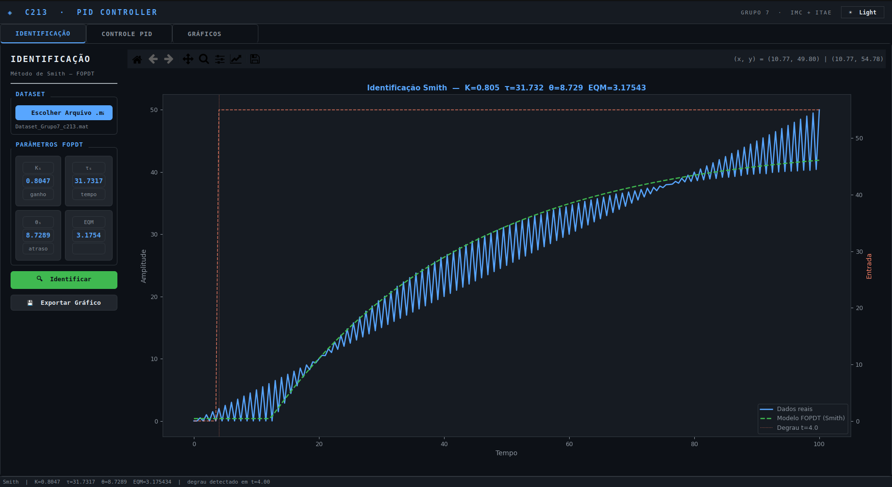
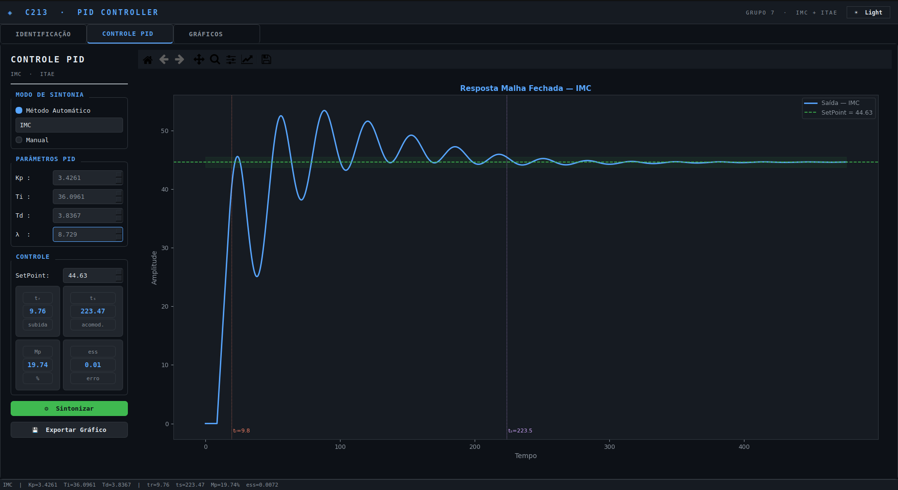
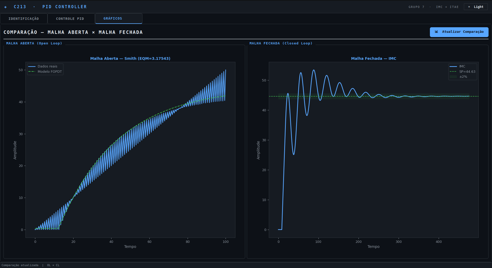
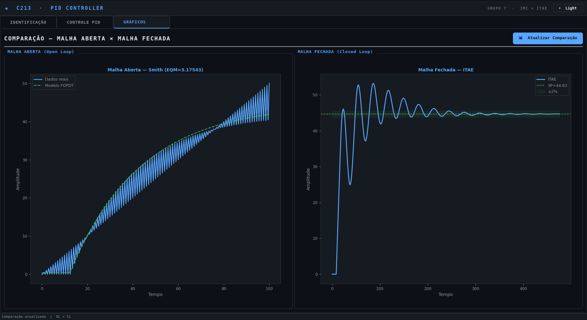

# C213 - PID Controller

Projeto desenvolvido para a disciplina **C213 - Sistemas Embarcados**. A aplicação realiza identificação de sistemas em malha aberta, sintonia de controladores PID e comparação entre respostas em malha aberta e malha fechada por meio de uma IHM em Python.

**Grupo:** 7  
**Métodos de sintonia:** IMC e ITAE  
**Arquitetura:** MVC, com separação entre modelo, controle e interface gráfica

## Integrantes

| Nome | Matrícula |
|---|---|
| DAVÍ PADULA RABELO | |
| KAUÃ VICTOR GARCIA SIÉCOLA | |
| MATHEUS RENÓ TORRES | |

## Sumário

- [Objetivo](#objetivo)
- [Funcionalidades](#funcionalidades)
- [Estrutura do projeto](#estrutura-do-projeto)
- [Instalação e execução](#instalação-e-execução)
- [Fluxo de uso](#fluxo-de-uso)
- [Modelo matemático](#modelo-matemático)
- [Sintonia PID](#sintonia-pid)
- [Métricas de desempenho](#métricas-de-desempenho)
- [IHM e resultados](#ihm-e-resultados)
- [Documentação dos módulos](#documentação-dos-módulos)
- [Limitações e melhorias futuras](#limitações-e-melhorias-futuras)

## Objetivo

O objetivo do projeto é integrar identificação de sistemas e controle PID em uma aplicação computacional capaz de:

1. carregar datasets experimentais em formato `.mat`;
2. identificar uma planta térmica por modelo FOPDT usando o método de Smith;
3. sintonizar controladores PID pelos métodos IMC e ITAE, definidos para o Grupo 7;
4. simular a resposta em malha fechada para um setpoint configurável;
5. calcular métricas de desempenho, como tempo de subida, tempo de acomodação, sobressinal e erro em regime permanente;
6. visualizar e exportar gráficos da resposta do sistema.

## Funcionalidades

| Área | Funcionalidade |
|---|---|
| Dataset | Leitura de arquivos MATLAB `.mat` com variáveis numéricas |
| Identificação | Detecção automática do degrau e identificação FOPDT pelo método de Smith |
| Sintonia PID | Seleção automática entre IMC e ITAE ou edição manual de `Kp`, `Ti` e `Td` |
| Simulação | Integração numérica da planta FOPDT com atraso e controlador PID |
| Métricas | Cálculo de `tr`, `ts`, `Mp` e `ess` |
| Visualização | Gráficos interativos com Matplotlib integrado ao PyQt5 |
| Comparação | Visualização lado a lado de malha aberta e malha fechada |
| Exportação | Salvamento de gráficos em PNG, PDF ou SVG |
| Interface | Tema escuro e tema claro com botão de alternância |

## Estrutura do projeto

```text
C213/
├─ app/
│  ├─ controllers/
│  │  ├─ __init__.py
│  │  └─ main_controller.py
│  ├─ models/
│  │  ├─ __init__.py
│  │  └─ system_model.py
│  └─ views/
│     ├─ __init__.py
│     └─ main_window.py
├─ docs/
│  ├─ GUIA_USO.md
│  ├─ MATEMATICA_CONTROLE.md
│  ├─ MODULOS.md
│  └─ img/
│     ├─ fig_01_estrutura_projeto.png
│     ├─ fig_02_identificacao_smith.png
│     ├─ fig_03_controle_pid_imc.png
│     ├─ fig_04_comparacao_imc.png
│     ├─ fig_05_controle_pid_itae.png
│     └─ fig_06_comparacao_itae.png
├─ main.py
├─ requirements.txt
├─ README.md
└─ .gitignore
```

- **Model:** contém carregamento de dados, identificação FOPDT, sintonia PID, simulação e métricas.
- **View:** contém a IHM em PyQt5, abas, campos, botões, gráficos e estilos.
- **Controller:** conecta eventos da interface aos algoritmos do modelo.
- **main:** cria a aplicação Qt, instancia a View e conecta o Controller.

## Instalação e execução

### 1. Criar ambiente virtual

```bash
python3 -m venv .venv
source .venv/bin/activate
```

No Windows:

```powershell
python -m venv .venv
.\.venv\Scripts\activate
```

### 2. Instalar dependências

```bash
python3 -m pip install --upgrade pip
python3 -m pip install -r requirements.txt
```

Dependências principais:

```text
PyQt5>=5.15.0
numpy>=1.21.0
scipy>=1.7.0
matplotlib>=3.4.0
```

### 3. Executar a aplicação

```bash
python3 main.py
```

Em algumas instalações Linux com Wayland, o Qt pode exigir bibliotecas adicionais para o backend XCB:

```bash
sudo apt install libxcb-cursor0 libxcb-xinerama0 libxkbcommon-x11-0
QT_QPA_PLATFORM=xcb python3 main.py
```

## Fluxo de uso

1. Abrir a aba **Identificação**.
2. Clicar em **Escolher Arquivo .mat**.
3. Selecionar o dataset experimental.
4. Clicar em **Identificar**.
5. Verificar os parâmetros FOPDT identificados: `K`, `τ`, `θ` e indicador de erro.
6. Abrir a aba **Controle PID**.
7. Selecionar o método de sintonia: **IMC** ou **ITAE**.
8. Ajustar o setpoint, quando necessário.
9. Clicar em **Sintonizar**.
10. Analisar a resposta em malha fechada e as métricas.
11. Abrir a aba **Gráficos** e clicar em **Atualizar Comparação**.
12. Exportar os gráficos, se necessário.

## Modelo matemático

A planta é aproximada por um modelo FOPDT, isto é, um sistema de primeira ordem com atraso:

$$
G(s)=\frac{K e^{-\theta_s}}{\tau_s+1}
$$

Em variáveis de desvio, a dinâmica simulada é:

$$
\tau \frac{dy_d(t)}{dt}=K u_d(t-\theta)-y_d(t)
$$

com:

$$
y(t)=y_0+y_d(t)
$$

em que:

- `K` é o ganho estático do processo;
- `τ` é a constante de tempo;
- `θ` é o atraso de transporte;
- `u_d(t)` é a entrada em variável de desvio;
- `y_d(t)` é a saída em variável de desvio.

### Identificação pelo método de Smith

O método implementado usa os pontos normalizados de 28,3% e 63,2% da resposta ao degrau.

O ganho é calculado por:

$$
K=\frac{\Delta y}{\Delta u}
$$

A saída normalizada é:

$$
y_N(t)=\frac{y(t)-y_0}{\Delta y}
$$

A partir de `y_N(t)`, obtêm-se:

$$
y_N(t_1)=0,283
$$

$$
y_N(t_2)=0,632
$$

Os parâmetros do modelo são estimados por:

$$
\tau=1,5(t_2-t_1)
$$

$$
\theta=(t_2-\tau)-t_{degrau}
$$

O indicador de erro exibido na interface é calculado no código como raiz do erro quadrático médio:

$$
EQM_{app}=\sqrt{\frac{1}{N}\sum_{i=1}^{N}\left(y_i-\hat{y}_i\right)^2}
$$

## Sintonia PID

O controlador PID é representado por:

$$
u(t)=K_p\left[e(t)+\frac{1}{T_i}\int e(t)dt+T_d\frac{de(t)}{dt}\right]
$$

em que:

$$
e(t)=SP-y(t)
$$

### Método IMC

O método IMC usa o parâmetro `λ` para ajustar o compromisso entre rapidez e robustez. Valores menores de `λ` tendem a gerar respostas mais rápidas, porém mais sensíveis a ruído e incertezas. Valores maiores tornam a resposta mais lenta e mais robusta.

A implementação usa:

$$
K_p=\frac{2\tau+\theta}{K(2\lambda+\theta)}
$$

$$
T_i=\tau+\frac{\theta}{2}
$$

$$
T_d=\frac{\tau\theta}{2\tau+\theta}
$$

### Método ITAE

O método ITAE busca reduzir o erro absoluto ponderado pelo tempo:

$$
ITAE=\int_0^\infty t |e(t)| dt
$$

A implementação usa:

$$
K_p=\frac{0,965}{K}\left(\frac{\theta}{\tau}\right)^{-0,85}
$$

$$
T_i=\frac{\tau}{0,796-0,147\left(\frac{\theta}{\tau}\right)}
$$

$$
T_d=0,308\tau\left(\frac{\theta}{\tau}\right)^{0,929}
$$

## Métricas de desempenho

As métricas calculadas para a resposta ao degrau em malha fechada são:

| Métrica | Símbolo | Definição |
|---|---:|---|
| Tempo de subida | `tr` | diferença entre os instantes em que a resposta cruza 10% e 90% do setpoint |
| Tempo de acomodação | `ts` | primeiro instante após o qual a resposta permanece na faixa de ±2% do setpoint |
| Sobressinal | `Mp` | percentual máximo acima do setpoint |
| Erro em regime permanente | `ess` | módulo da diferença entre o setpoint e a média final da resposta |

$$
t_r=t_{90\%}-t_{10\%}
$$

$$
M_p=\frac{y_{max}-SP}{SP}\cdot 100\%
$$

$$
ess=\left|SP-\bar{y}_{final}\right|
$$

## IHM e resultados

### Aba de Identificação

A aba **Identificação** permite carregar o dataset `.mat`, executar o método de Smith e visualizar a comparação entre dados reais e modelo FOPDT. No exemplo mostrado, a identificação resultou aproximadamente em:

| Parâmetro | Valor aproximado |
|---|---:|
| `K` | 0,8047 |
| `τ` | 31,7317 |
| `θ` | 8,7289 |
| `EQM_app` | 3,17543 |

**Figura 1: Aba Identificação com modelo FOPDT obtido pelo método de Smith.**



### Aba Controle PID com IMC

A aba **Controle PID** permite selecionar o método automático, configurar o setpoint e visualizar a resposta em malha fechada. Para o método IMC, o parâmetro `λ` permanece associado à robustez da resposta.

**Figura 2: Aba Controle PID com sintonia IMC.**



### Comparação com IMC

A aba **Gráficos** compara a resposta em malha aberta identificada com a resposta em malha fechada usando o controlador sintonizado.

**Figura 3: Comparação entre malha aberta e malha fechada com IMC.**



### Aba Controle PID com ITAE

No método ITAE, o parâmetro `λ` não é utilizado e aparece como `N/A`. O sistema calcula automaticamente `Kp`, `Ti` e `Td` com base no modelo identificado.

**Figura 4: Aba Controle PID com sintonia ITAE.**


### Comparação com ITAE

A comparação com ITAE permite verificar graficamente o comportamento da sintonia alternativa definida para o Grupo 7.

**Figura 5: Comparação entre malha aberta e malha fechada com ITAE.**



## Documentação dos módulos

A documentação detalhada está organizada nos arquivos abaixo:

- [`docs/MODULOS.md`](docs/MODULOS.md): descrição técnica dos arquivos, classes e funções.
- [`docs/MATEMATICA_CONTROLE.md`](docs/MATEMATICA_CONTROLE.md): detalhamento matemático da identificação, sintonia e simulação.
- [`docs/GUIA_USO.md`](docs/GUIA_USO.md): roteiro de uso da IHM e interpretação dos resultados.

## Limitações e melhorias futuras

- A seleção das variáveis de entrada e saída do `.mat` é feita por heurística de variância.
- A identificação por Smith é sensível a ruído e respostas não monotônicas.
- O modelo usado para simulação é FOPDT, portanto dinâmicas de ordem superior são aproximadas.
- A simulação usa integração numérica por Euler, suficiente para análise didática, mas não substitui uma análise industrial validada.
- O projeto pode ser ampliado com outros métodos de sintonia, validação de estabilidade mais rigorosa, seleção manual das variáveis do dataset e geração automática de relatório.

## Referências conceituais

- C. L. Smith, *Digital Computer Process Control*, 1972.
- D. E. Rivera, M. Morari e S. Skogestad, *Internal Model Control: PID Controller Design*, 1986.
- D. E. Seborg, T. F. Edgar e D. A. Mellichamp, *Process Dynamics and Control*, 2016.
